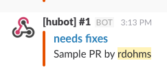

# DMS Github Integration for Slack

This is a Sloth plugin that improves on the default Slack/Github intagration, by adding more options and more informational messages. Each tool needs to be properly hooked up to webhooks, so each can be enabled on demand.

## Install

To activate this plugin, simple require it in a Sloth project with

`composer require dms/sloth-github-plugin`

### Github Webhooks

Each feature has its own endpoint that needs to be hooked up to github. Please refer to each of the features below to hook them as needed.

## Features

### Better PR Comments

The standard Github/Slack integration gives a limited amount of information when a message is posted to Slack, this integration improves on that and provides a more complete set of information, allowing you to have all the context you need to decide if the message is relevant for you.

This is what a regular comment looks like:


And a review comment:


#### Install

Hook up these url to your Github repository

For Regular comments
* **Endpoint**: `<sloth-url>/plugin/dms/pr/comment`
* **Events**: `issue_comment`

For Review (inline) comments
* **Endpoint**: `<sloth-url>/plugin/dms/pr/review-comment`
* **Events**: `pull_request_review_comment`

### Label Notifiers

This plugin will broadcast a message to Slack when ever a label that matches an internal regular expression is added to a ticket, internally we used this one to let us know when a PR was reviewed and needed changes to be made for example.

This is an example:



#### Install

Hook up these url to your Github repository
* **Endpoint**: `<sloth-url>/plugin/dms/label/notify`
* **Events**: `issues`

#### Configuration

You can change the regular expression which decides which labels are pushed to slack.

```php
'dms.github.label-manager' => [
    'actionable.regexp' => '<REGEXP>'
]
```
